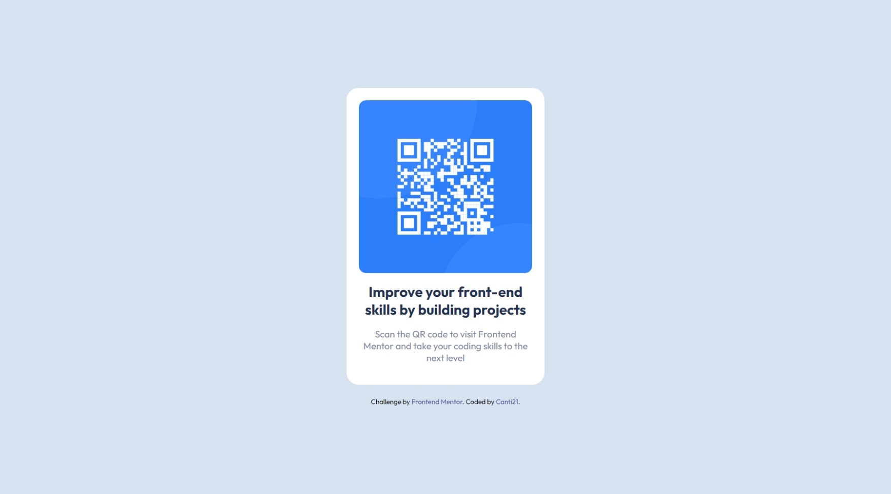

# Frontend Mentor - QR code component solution

This is a solution to the [QR code component challenge on Frontend Mentor](https://www.frontendmentor.io/challenges/qr-code-component-iux_sIO_H). 

## Table of contents

- [Overview](#overview)
  - [Screenshot](#screenshot)
  - [Links](#links)
- [My process](#my-process)
  - [Built with](#built-with)
  - [What I learned](#what-i-learned)
- [Author](#author)

**Note: Delete this note and update the table of contents based on what sections you keep.**

## Overview

### Screenshots

 Desktop View (1440 x 800):

 

 Mobile View (375 x 667):

 


### Links

- Solution URL: [Solution](https://www.frontendmentor.io/solutions/qr-component-tP37yujigo)
- Live Site URL: [Deploy](https://canti21.github.io/qr-code-component/)

## My process

### Built with

- HTML5
- CSS custom properties
- CSS Grid
- Mobile-first workflow

### What I learned

Centering vertically without using grid or flex:

```css
.center-vertically
{
  position: relative;
  top: 50%;
  transform: translate(0, -50%);
}
```

## Author

- Website - [Github](https://github.com/Canti21)
- Frontend Mentor - [@Canti21](https://www.frontendmentor.io/profile/Canti21)
- Twitter - [@Canti2100](https://www.twitter.com/Canti2100)
